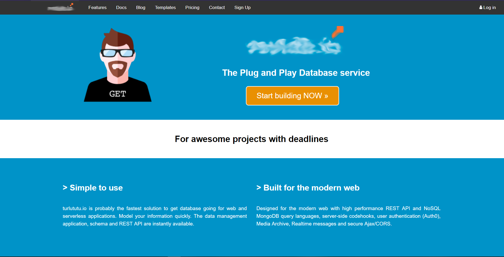
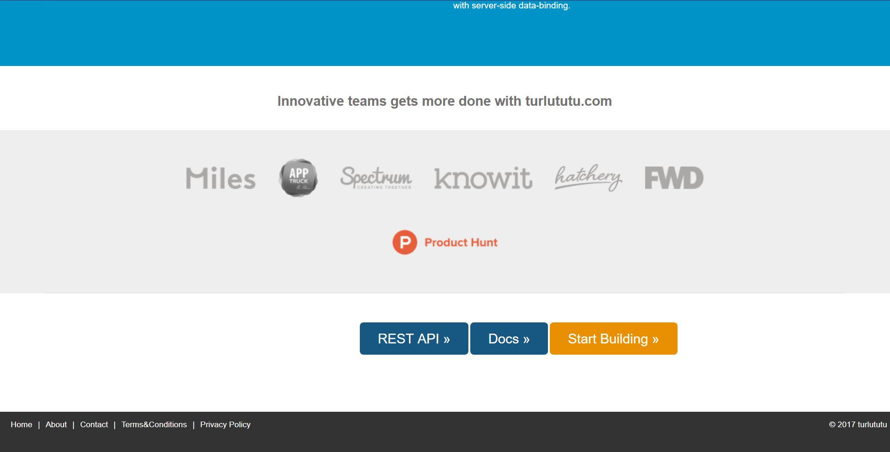

# **Home-page-of-turlututu**
by Sifedine Hajji

## What ?

with the help of a screenshot we were asked to recreate a copy of it using html and css.
This work is done individually but we can get help from a friend or find solutions on the internet.
 
## When did i work on it ?

The Work was given on Monday 28th october and i finished it on wednesday 30th bacause i had another work :[Doc-The-Chinese-Farmer](https://sifedine-hajji.github.io/Progressive-Enhancement/). I recently refined it.

## What does it look like ?

Here is the direct link to the site I made [Homepage of Turlututu](https://sifedine-hajji.github.io/Home-page-of-turlututu/) to get a final rendering of the work.

#### **Here is some screenshots of the website** :

## License

© Hajji Sifedine 

